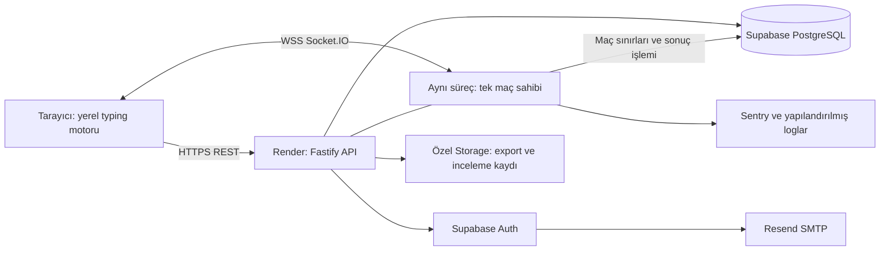
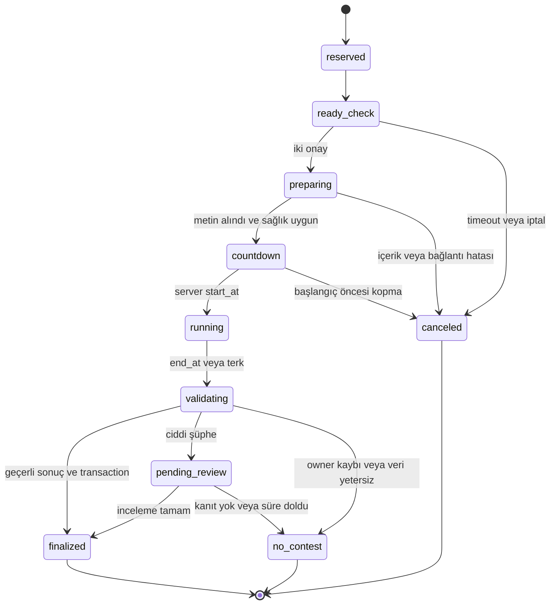

# Teknik mimari ve stack

**25 Eylül 2026 · Revizyon 1 · Tasarım kararı; çalışan sistem veya benchmark değildir.**

## 1. Dağıtım sınırı

MVP bir modüler monolittir: tek Node.js süreci HTTP API, statik uygulama dosyaları, Socket.IO, matchmaking, maç sahipliği ve küçük background işleri yürütür. Bir Supabase projesi PostgreSQL, Auth ve gerektiğinde özel dosya depolamayı sağlar. Sentry operasyon görünürlüğü, Resend üretim auth e-postası içindir.



Yazma sırasında DB'ye tuş başına yazılmaz. Input, bağlantılı maç sahibinin RAM'inde doğrulanır. Maç sınırları ve nihai sonuçlar kalıcıdır. Bir maçın in-memory durumunu kaybeden süreç, eksik olaylardan kazanan uydurmaz.

## 2. Stack kararları ve alternatifler

### Frontend

**TypeScript + React + Vite, React Router, TanStack Query; CSS Modules + CSS custom properties; seçili Radix primitives.** React'ın güncel stable serisi 19; major sürümleri uygulama başlangıcında pinle, caret bağımlılıklarına güvenerek otomatik yükseltme yapma. Node 24 LTS geliştirme/üretim ortak runtime'dır. [React yaklaşımı](https://react.dev/learn/build-a-react-app-from-scratch), [Vite](https://vite.dev/guide/), [Node release takvimi](https://github.com/nodejs/Release).

React seçimi input hızının garantisi değildir; saf TypeScript motoru UI'den ayrılır. React sadece görünüm ve seyrek durum geçişlerini yönetir. Aktif tuş state'i route çapında Context/Query/Redux'a yazılmaz. Küçük external store + `useSyncExternalStore` ve frame bazlı render; ref'lerle imperative sıcak yol ancak ölçüm gerektirirse. Worker her tuş için zorunlu değildir; sonradan ağır analiz ana thread dışına alınır.

TanStack Query HTTP verisinin cache/retry/invalidation'ını yönetir; canlı maç protokolünü yönetmez. Redux/Zustand/XState launch bağımlılığı değil; typing saf reducer, maç geçişleri explicit state machine'dir. [Query kapsamı](https://tanstack.com/query/latest/docs/framework/react/overview).

CSS Modules ve tokenlar küçük component sistemini tasarıma bağlar; hazır dashboard teması kopyalanmaz. Dialog, menü, tabs gibi davranışlarda Radix kullanılır; accessibility hâlâ uygulamanın sorumluluğudur. Tailwind geçerli alternatif, fakat MVP için şart değil. [Radix erişilebilirlik sınırları](https://www.radix-ui.com/primitives/docs/overview/accessibility).

**Next.js neden seçilmedi:** maç runtime'ı zaten sürekli açık sunucu gerektiriyor; private uygulama için RSC/SSR cache modeli ek fayda sağlamıyor. SEO ihtiyacı MVP'de `/`, kurallar ve yardım sayfalarının statik HTML'idir. React SPA'nın daha sonra SSR/SSG ihtiyacında framework işi yaratabileceği kabul edilir; public katalog büyürse yeniden değerlendirilir. Unknown route gerçek 404; private profil/match noindex. Vite asset'leri Fastify'dan sunulur; ayrı frontend host'u launch'ta gerekmez.

SvelteKit, Vue ve Solid teknik olarak uygundur; bugün platforma özgü avantajları, motorun taşınabilirliğine göre belirleyici değil. Ekip başka framework'te belirgin daha deneyimliyse bunun için karar yeniden açılabilir; burada ekip deneyimi ölçülmüş varsayılmaz.

### Backend ve API

**Node.js 24 LTS + Fastify 5 desteklenen patch + Socket.IO 4 + PostgreSQL sürücüsü `pg` + Drizzle.** Fastify schema validation/logging/plugin sınırları ve Node'un ortak TypeScript domain kodu geliştirmeyi sadeleştirir; benchmark pazarlamasından kapasite çıkarılmaz. Fastify/Node kombinasyonu lockfile ve CI'da doğrulanır. [Fastify LTS politikası](https://fastify.dev/docs/latest/Reference/LTS/).

REST JSON `/api/v1`: hesap, profil, geçmiş, davet, export, rapor, sonuç okumaları. WS: queue, ready, input, canlı state. Komut/yanıt şemaları runtime validation ile doğrulanır; TypeScript tipi tek başına güvenlik sınırı değildir. Fastify JSON Schema/TypeBox üzerinden ortak şema ve API sözleşmesi; GraphQL/tRPC zorunlu değil.

Modüller: identity, content/rules, typing-core, matchmaking, match-runtime, results/ratings, moderation, analytics/jobs. pnpm workspace'te web/server/shared paket sınırları olabilir; ayrı servis veya Nx/Turborepo gerekmez. İstemciye shared içinde yalnızca kamuya açık kurallar gider; gizli anti-abuse eşiği/anahtar gitmez.

Go/Phoenix concurrency bakımından güçlü alternatiflerdir; bu aşamada ikinci dil ve başka domain modeli maliyetini haklı çıkaran yük kanıtı yok. Bun/Deno'nun performans iddiaları deployment/bağımlılık uyumluluğu doğrulanmadan runtime değiştirme gerekçesi sayılmaz.

### Realtime

**Socket.IO, yalnızca WebSocket transport, HTTPS ile aynı origin ve port.** Ready ack, room adresleme ve reconnect araçları geliştirme hızını artırır. Native `ws` daha küçük; aynı protokol state/retry/heartbeat işlerini elle kurmak gerekir. Socket.IO normal WebSocket JSON istemcisiyle wire-compatible değildir; hem gerçek browser hem sentetik test Socket.IO protokolünü kullanmalıdır.

HTTP long-polling fallback yok; WSS engellenirse solo çalışır, ranked uygun değil mesajı çıkar. Redis adapter launch'ta yok. Socket.IO sıralı mesaj sağlar fakat varsayılan teslimat at-most-once'dır; uygulama ack/seq/idempotency sorumluluğu kalır. [Teslimat garantileri](https://socket.io/docs/v4/delivery-guarantees/).

Supabase Realtime/Ably/Pusher mesaj fanout'unu kolaylaştırır; typing skorunu ve rank'ı kendi başına authoritative yapmaz. Aynı işi ikinci realtime servise dağıtmıyoruz. Cloudflare Durable Objects tek owner ve WebSocket için gerçek alternatiftir; runtime/lifecycle ve Postgres ile çapraz işlem karmaşıklığı nedeniyle launch'ta seçilmedi. Sürekli aktif kısa maçlar için idle hibernation tasarrufu ölçülmeden maliyet üstünlüğü varsayılmaz. [Durable Objects WebSocket modeli](https://developers.cloudflare.com/durable-objects/best-practices/websockets/).

### Veritabanı, cache ve işler

**Supabase managed PostgreSQL**, sağlayıcının desteklediği stable major. Standart SQL migration'ları Drizzle ile; production'da otomatik schema push yok. İki tarafın result/rating değişimi tek SQL transaction'dır. PostgreSQL atomiklik, unique constraints ve row locks bu problemin merkezindedir. [PostgreSQL kilitler](https://www.postgresql.org/docs/current/explicit-locking.html), [Drizzle transactions](https://orm.drizzle.team/docs/transactions).

Firebase/Firestore'ın realtime kolaylığı bu tutarlılık ihtiyacını ortadan kaldırmaz. SQLite lokal prototipte kullanılabilir fakat concurrency/transaction testleri gerçek PostgreSQL üstünde yapılmalıdır; ikinci production DB türü kullanılmaz.

Cache: süreçte kısa TTL'li leaderboard/konfigürasyon. Redis/BullMQ/Kafka yok. Az sayıda durable iş `job` tablosu + `FOR UPDATE SKIP LOCKED`, retry/backoff ve lease ile aynı süreçte çalışır. Sonuç transaction'ındaki outbox satırı analytics ve aggregation işini güvenilir tetikler. İşler en-az-bir-kez çalışabilir; consumer'lar idempotenttir. Ağır rapor/replay işi match event loop'unu bloklayamaz; iş boyutu sınırlıdır, gerektiğinde worker thread/ayrı worker'a taşınır.

### Auth

**Supabase Auth: Google OAuth + email OTP; üretimde Resend SMTP.** Kendi parola sistemi, self-hosted Keycloak veya telefon/SMS yok. Managed Auth'un teslim edilebilirlik ve hesap yönetimini almak daha az operasyon yüküdür. Supabase varsayılan SMTP'si üretim login hizmeti yerine kullanılmaz. [SMTP gereksinimleri](https://supabase.com/docs/guides/auth/auth-smtp).

BFF modeli: OAuth state/PKCE ve OTP doğrulaması Fastify auth uçlarında; sağlayıcı tokenları browser localStorage'a konmaz. Browser yalnızca random opaque uygulama session cookie taşır (`Secure`, `HttpOnly`, `SameSite=Lax`, host-only, path `/`). Session ID'nin hash'i DB'de, gerektiğinde provider refresh tokenı ayrı yönetilen anahtarla şifreli saklanır. Supabase browser SSR helper'ının varsayılan cookie davranışının otomatik HttpOnly olduğunu varsayma; server-only auth adapter burada bilinçli uygulama işidir.

Oturum kaydı user_id, expiry/revocation ve sağlayıcı bağını tutar. Başlangıç hedefi 7 gün idle / 30 gün mutlak ömür; provider daha erken invalid olursa geçersiz. Refresh single-flight; aynı tokenın eşzamanlı kullanımından race oluşmaz. OAuth callback redirect allowlist; provider id/email ile güvenli account linking, kullanıcı onayı olmadan hesap birleştirme yok. Logout ve deletion tüm ilgili WS bağlantılarını kapatır; daha sonraki komutlar reddedilir.

MVP guest özel düello için süreli guest session kullanır, Supabase anonymous account yaratmaz. Guest rating alamaz; kalıcı hesaba result upgrade yok. Bu, auth MAU ve sahte hesap yükünü azaltır.

### Storage, analytics ve monitoring

MVP'de avatar upload/custom text yok. Match input paketleri boyut sınırlı, sıkıştırılmış `bytea` olarak geçici PostgreSQL partition/tablosunda tutulabilir; her tuşa bir satır yazılmaz. Büyük replay hacmi oluşursa özel Supabase Storage'a taşınır. Storage MVP'de export dosyaları ve incelemeye alınan büyük kanıt paketleri için kullanılır; signed link kısa ömürlü, bucket public değil.

Ürün analytics'i başlangıçta allowlist'li birinci taraf event endpoint'i, PostgreSQL günlük özetler ve versiyonlanmış SQL raporlarıdır. Yeni analytics UI/framework yazılmaz. Key event başına ürün analytics olayı gönderilmez. PostHog yönetilen analytics cohort/experiment ihtiyaçları SQL raporlarını aşınca tercih edilir; autopcapture ve session replay varsayılan kapalı olur. Self-hosted PostHog launch işletim kapsamına girmez. [PostHog fiyat/kapsam](https://posthog.com/pricing).

Sentry browser/server error, seyrek tracing ve dışarıdan uptime; Pino yapılandırılmış loglar; Render host kaynak ölçümleri. Her maç için correlation ID, ruleset ve build version. Input içeriği, email, token, session cookie, challenge secret ve IP log gövdesine düşmez. Replay SDK'sı kapalı; input breadcrumbs redact edilir. [Sentry planları](https://sentry.io/pricing/).

### Hosting ve test araçları

**Render paid web service + aynı coğrafi bölgede Supabase Pro**; ilk pilot Frankfurt, gecikme ölçümüyle doğrulanır. Render inbound WSS ve uzun bağlantıları destekler; deploy/maintenance bağlantıyı kesebilir, reconnect başka instance'a gidebilir. Default graceful shutdown penceresi maç drain'i için artırılır; uygulamada 60 saniyelik drain hedefi. [Render WebSockets](https://render.com/docs/websocket).

Free/sleeping servisler yalnızca prototip içindir. Vercel frontend hosting olarak mümkün; WSS maç sunucusu için ayrı backend gerektirdiğinden bugün üçüncü hosting katmanı eklenmez. VPS + Docker ucuz olabilir fakat patch, backup, TLS ve incident sorumluluğu ekipte kalır; fiyat tek seçim ölçütü değildir.

Test: Vitest + fast-check motor ve invariants; gerçek PostgreSQL üzerinde integration/Testcontainers; Playwright Chromium/Firefox/WebKit kullanıcı yolculukları; `socket.io-client` ile protokol yük/fault harness; Toxiproxy veya ağ emülasyonuyla gecikme/jitter/drop. Normal HTTP load testi realtime doğruluk testi yerine geçmez. Build/typecheck/lint/migration/security checks CI'da; gerekli kabul senaryoları [uygulama planında](VALIDATION_ROADMAP.md).

## 3. Yetki ve sıcak yol

**Client:** hedefi gösterir, input/composition okur, buffer'ı anında yerelde işler, caret ve geçici metrikleri çizer, sıralı olayları paketler. Rakip konumuna hafif interpolation yapabilir; nihai durum uyduramaz.

**Server:** içerik/başlangıç/bitiş/katılımcılar, event kabulü, replay ile C/A/I hesabı, bağlantı ve sonucu belirler; rating ve tarihçeyi transaction'da işler. Client `score`, `winner`, `duration`, `rank_delta` gönderse bile hesap kaynağı olarak kullanmaz.

**Sınır:** server kabul edilen akışı yeniden üretebilir; bunu insanın klavyede ürettiğini bilemez. İstemci zamanı analize yarar, otorite değildir. İmzalı match tokenı katılım yetkisini kanıtlar; dürüst input'u kanıtlamaz.

## 4. Maç durum makinesi ve kalıcılık



Participant bağlantısı `connected/disconnected/resuming/finished/abandoned` ayrı state'tir; kopan biri bütün maçı paused yapmaz. Match outcome `win/draw/forfeit/no_contest` olup yaşam döngüsü state'iyle karıştırılmaz.

Kalıcı Match kaydı countdown'dan önce oluşturulur; state_version, owner_epoch, ruleset/content, participants, scheduled time ve pre-match rating snapshot saklanır. Geçişler expected state_version + owner_epoch kontrolüyle atomik uygulanır. Süreç kaybında eski epoch'un canlı/hazırlanan maçları ve kanıtı kalıcılaşmamış validating maçları no-contest olur; memory'de kaybolan input'tan ranked recovery yok. Tam kanıtıyla transaction içinde pending_review durumuna alınmış maçlar kalıcı inceleme işi olarak devam eder; sıradan deploy bunları iptal etmez.

## 5. Protokol ve input kabulü

Envelope: `protocol_version`, `match_id`, `participant_id`, `connection_generation`, `client_seq`, `type`, `payload`. `participant_id` istemciden yetki olarak kabul edilmez; authenticated socket üyeliğiyle eşleştirilir.

Komutlar: `queue.join/cancel`, `match.ready`, `content.ack`, `input.batch`, `match.resume`, `match.finish_ack`, `rematch.request/accept`. State mesajları: `queue.status`, `match.offer`, `match.prepared`, `match.start`, `input.ack`, `match.snapshot`, `match.progress`, `match.result`. Her state sürümlüdür; eski snapshot yenisini ezemez.

Input: her ekleme için `insert(character)` ve `deleteBackward`; keyboard shortcut ile kelime silme sunucunun bildiği deterministic delete-to-word-boundary komutudur. Her olay ardışık sıra ve monoton client elapsed time taşır. ASCII dışı, toplu insert, ileri index atlama, selection-replace ve post-deadline komutları geçerli ranked girdisi değildir. Composition/dead-key için browser normalizasyon testleri yapılır; keydown fiziksel tuş listesi tek başına metin kaynağı değildir.

Başlangıç paket politikası: 50 ms'de bir veya 8 olayda bir flush; maçın son 500 ms'sinde mümkünse 20 ms. Client packet timing garantisi veremez; background timer throttling gerçek risktir. Sunucu en fazla 10 Hz opponent progress gönderir; DB write/analytics/event başına fanout yok. Ara progress düşebilir; result/control mesajları ack/retry veya snapshot ile telafi edilir.

Sıra kuralları:

- Aynı seq + aynı payload tekrar gelirse yeniden uygulanmaz; önceki ack dönülür.
- Aynı seq + farklı payload protokol ihlalidir.
- Gap varsa son kabul edilmiş seq bildirilir; kısa süre içinde yalnızca hâlâ zaman penceresinde olan eksik olaylar tamamlanabilir. Daha sonraki olaylar gap üstünden atlanıp skor üretemez.
- Geçerli insert/delete server buffer'ını değiştirir. Hatalı suffix en fazla 64 karakter; daha fazla ilerleme reddedilir ve kullanıcı düzeltmeye yöneltilir. Metin limiti 10.000 karakterdir; meşru metin tüketimi bu limite ulaşırsa no-contest ve kapasite hatası incelemesi, otomatik cheat ban değil.
- Client en fazla 500 ms'lik onaysız input tutar; backlog taşarsa yazmayı durdurup snapshot ister. Tampon sınırsız büyümez.

Komut sınırları başlangıçta 16 KiB paket, saniyede 40 input batch (burst 60), katılımcı başına 100 input olayı/s (burst 200), hesap başına tek aktif oyun bağlantısı. Bunlar saldırı kaynak sınırlarıdır, "insan şu WPM'i aşamaz" iddiası değildir. Aşımda bağlantı/maç politikası ve report sinyali; doğrudan kalıcı hesap banı yok. Testlerde hızlı gerçek kullanıcıların batch burst'leriyle sınanır.

## 6. Zaman, latency ve skor sınırı

Sunucu wall clock yalnızca tarihleme; maç süresinde monotonic clock kullanılır. Preflight'ta ping/pong örneklerinden client-server offset yaklaşık hesaplanır. İki taraf aynı tam metni alınca ortak `start_at` en az 3 saniye ileride planlanır; local countdown bu epoch'un görsel karşılığıdır. Paket geç gelirse kullanıcıya daha kısa yarış verilmez; start öncesi iptal edilir.

**Launch zaman kuralı bilinçli olarak basittir: skora yalnızca sunucuda `[start_at, end_at)` aralığında alınan input girer. Bitişten sonra skor grace veya client-time rewind yok.** Sunucu zamanı ve protokol validasyonu nihai otoritedir. Client elapsed time manipülasyonu bitişi uzatamaz. Wall clock sıçraması maç süresini değiştirmez.

Bu kural ağ gecikmesini tamamen yok etmez: yüksek RTT'li oyuncunun son bazı karakterleri yetişmeyebilir. RTT ve çiftler arası ping farkı sınırları bu farkı küçültür; “sıfır latency avantajı” vaadi verilmez. Kabul edilen client timestamp'lerinin yaş/sıra tutarlılığı sadece sinyaldir. Public açılış öncesi eşit akışları 20/100/200 ms RTT'de gönderip son C sapması ölçülür. Adaletsizlik kabul edilemezse launch ertelenir; sorgusuz client timestamp güvenine geçilmez.

`finish_ack`/bağlantı final kontrolü için bitişten sonra en fazla 5 saniye beklenebilir; bu sürede tek karakter bile skora eklenmez. Sonuç gecikmesi skor süresinin uzaması değildir. Son packet/ack yolda kaldığında retry yalnızca sonucu/snapshot'ı kurtarır.

Metin countdown'da istemcide bulunduğundan bot bunu önceden okuyabilir. Metni gizlemek, chunk'lamak veya şifrelemek browser sahipliğini ortadan kaldırmaz. Launch'ta chunk reveal ile insanın okuma akıcılığı bozulmaz; anti-cheat bu sınırı kabul eder.

## 7. Reconnect, iki sekme ve terk

Uygulama liveness heartbeat 1 saniyede bir; 3 saniye sessizlikte reconnect mesajı. Socket.IO transport timeout'u tek oyun saati değildir. Dönüş için hard deadline son doğrulanmış liveness +5 saniye; explicit transport close daha önce gelirse close anı +5 saniye. Maç sonundaki finish_ack en geç end_at+5 saniye kabul edilir; daha önce dolmuş disconnect deadline'ını yeniden açmaz. End_at'ta server'ın gönderdiği taze final nonce'a cevap verir; yalnızca client'ın gönderdiği "bittim" mesajı liveness kanıtı sayılmaz.

Resume authenticated match üyeliğiyle yapılır; server yeni connection generation verir ve önceki soketi input için geçersiz kılar. Son onaylı seq, buffer, C/A/I, kalan süre, rakip durumu ve state_version dönülür. İstemci kabul edilmemiş/eskimiş input'u temizler; offline girişleri sonradan yüklemez. Süre durmaz ve kaybolan süre geri verilmez.

Aktif game session varken ikinci sekme rated queue açamaz. Kullanıcı açıkça "Bu sekmede devam et" seçerse ilk bağlantı fence edilir. Refresh de resume'dur; yeni maç değildir. Yetkisiz match_id ile resume reddedilir.

Hard deadline'a kadar bir oyuncu dönmezse forfeit adayı; diğeri de dönmezse double-abandon. Genel sunucu olayı tespit edilmişse forfeit yerine no-contest. TCP açık kalıp input gelmemesi AFK olabilir; hayali disconnect sayılmaz. Finish ack network canlılığını doğrular, final score vermez.

## 8. Nihai transaction ve failure semantiği

Normal maçta doğrulama + küçük replay paketi hazırlanır. Tek transaction:

1. Match ve iki rating satırını user_id sırasıyla `FOR UPDATE` kilitle.
2. Canlı sonuçta owner epoch/state; kalıcı pending_review sonucunda yetkili karar/job ve expected state_version kontrolü yap. İki yolda da result uniqueness, RatingCurrent.pending_match_id ve önceden ayrılmış rating snapshot'larını doğrula.
3. İki participant'ın immutable sonucunu ve evidence referansını yaz.
4. Elo delta ve pre/post değerlerini `rating_ledger`'a ekle; `rating_current` güncelle.
5. Match'i finalized yap; yalnızca bu match_id'ye ait canlı katılım rezervasyonunu ve iki RatingCurrent.pending_match_id kilidini kaldır. Review sırasında başlamış başka bir puansız maçın rezervasyonuna dokunma.
6. Aynı transaction'da outbox olayını ekle; commit sonrası result yayınla.

`match_id + participant_id + ledger_kind` unique constraint'i, tekrar finalize/rating yazımını engeller. İki tarafın puanı ya birlikte değişir ya hiç değişmez. Aynı sonucu ikinci kez finalleştiren istek kaydedilmiş sonucu döndürür. Gönderim exactly-once değildir; **etki** veritabanı tekilleştirmesiyle bir kez olur.

DB unavailable: yeni rated start durur; mevcut maç RAM'de bitirilebilir, sonuç `validating` kalır ve bounded retry yapar. Process de ölürse eksik kanıtlı maç no-contest; DB geri gelmeden başarılı sonuç iddiası yok. Committed sonuçtan sonra emit öncesi crash olursa GET/resume kalıcı sonucu döndürür.

Ciddi şüphede tam input kanıtı ve sonuç adayı tek transaction ile kaydedilir, maç pending_review olur. Canlı katılım rezervasyonu bırakılır; iki RatingCurrent.pending_match_id kilidi tutulur, böylece yeni rated maç kapalı ama casual/solo açıktır. 24 saat hedefli inceleme; sonuç geçerliyse aynı snapshot üzerinden finalize, kanıt yetersiz veya deadline aşılmışsa no-contest ve lock release. Anomali nedeniyle masum rakibi uzun tutma riski olduğundan çoğu düşük güven sinyali sonuç sonrası incelemedir.

Final sonrası kanıtlı cheating: ham sonucu overwrite etme; moderation decision + özgün deltalara bağlı bir defalık compensation ledger yaz. Banned oyuncunun tüm ladder geçmişini sessizce yeniden hesaplama; etkilenen maçları invalid işaretle, masum tarafa önceden kaybettiği delta iade et, haksız kazanımı geri al. Compensation işi ilgili rating satırında pending_match_id boşalana kadar bekler; aktif rated maçın pre-match snapshot'ını bozmaz. Sonra mevcut rating'e özgün delta düzeltmesini transaction içinde ekler ve iki taraf etkisini tekilleştirir. Bu politika downstream rating'in tam yeniden simülasyonu değildir; büyük çaplı olayda açıklanmış ruleset/ladder migration gerekir.

## 9. Tek sahip, deploy ve büyüme yolu

Birden çok süreç yanlışlıkla başlasa da yalnızca DB'deki `runtime_owner` lease/epoch'ünü taşıyan süreç ranked kabul eder. Lease 10 saniye, renewal 2 saniye; renewal belirsizliğinde yeni maç durur, expiry'den önce aktif owner skor kabulünü durdurur. Kalıcı geçişler güncel epoch'u transaction içinde kontrol eder; eski owner geçerli sonuç commit edemez. DB saati lease için, monotonic saat maç için kullanılır.

Planned deploy: queue'yu kapat → aktif maçları en fazla 60 saniye drain et → kalanları gerekçeli no-contest yap → owner lease bırak → deploy → yeni owner al → probe geçince queue aç. Render rolling deploy sırasında iki ayrı queue oluşmamalı; yeni instance owner almadan ranked healthy sayılmaz. Frontend/API ayrı health/readiness endpoint'leri kullanır. Bakımda kısa ranked kesintisi kabul edilir; "zero downtime match migration" vaadi yok.

Growth tetikleri: event-loop p99 >20 ms, sustained CPU >%60, memory bütçesi >%70, connection/queue tick bütçesi aşımı veya bölgelerde RTT dışlanması. Önce profiler ve dikey ölçek; kapasite benchmark'ına göre admission cap. Sonra API ve job worker ayrılır. Multi-owner için gateway routing + owner directory + epoch/fencing + bölgesel queue gereklidir; yalnızca Redis adapter eklemek authoritative state'i paylaşmaz. Redis ticket/presence/coordinator için bu noktada eklenebilir. [Socket.IO multi-node gereksinimleri](https://socket.io/docs/v4/using-multiple-nodes/).

Post-MVP 4–8 kişilik race: aynı participant koleksiyonu, aynı content/clock, herkese paketlenmiş progress snapshot 5–10 Hz; her input'u her kullanıcıya yayınlama. Multiplayer puansız; 1v1 Elo'yu ikili sonuçlara bölerek uygulama yok. Spectator ayrı read-only subscription, örneğin 5 saniye gecikmeli snapshot ve authorization; match input verisi yayınlanmaz. Tournament ileride bracket/match orchestrator üzerinden aynı create-match komutunu çağırır; skor otoritesi turnuva servisine taşınmaz.

## 10. Domain ve veritabanı modeli

### Kimlik ve içerik

- **User:** uygulama id, auth_provider subject unique, created_at, account_status, deleted_at. Supabase Auth email/identity sahibidir; uygulama tablolarında email çoğaltılmaz.
- **Profile:** user_id bire bir, normalized username unique, display_name, hazır avatar_key, visibility. Username tarihçesi destek/impersonation için sınırlı tutulur; kullanıcı kontrollü HTML/bio/upload MVP'de yok.
- **AppSession / GuestSession:** hashed session id, ilgili principal, expire/revoke; provider refresh verisi yalnızca server erişiminde şifreli. Guest için public profile veya rating satırı yok.
- **UserSettings / ConsentRecord:** küçük sürümlü tercihler; consent purpose/version/time ve withdrawal kaydı ayrı. Essential match integrity ile opsiyonel product analytics karıştırılmaz.
- **RulesetVersion / ContentPoolVersion:** immutable format, süre, normalization, scoring/input sürümü, word-list lisansı, corpus hash'i. Kaynak lisansı doğrulanmamış liste public ranked'e girmez.
- **TextArtifact:** ruleset/pool/generator sürümü, seed, hash, tam üretilmiş metin. Bir Match bir TextArtifact kullanır; aynı metin ghost ile yeniden kullanılabilir, rated maçlar yeni seed alır.

### Oyun ve rating

- **TypingSession:** yalnızca solo/practice oturumu; user_id nullable, ruleset, started/ended_at, trust=`client_reported|server_observed`, verified olmayan guest sonucu tercihen yalnızca cihazda. Tamamlanmamış oturum `abandoned`; ayrı TypingResult tablosuyla aynı metrikler çoğaltılmaz. Final metrik alanları terminal hale gelince immutable; silme politikası istisnadır.
- **Match:** mode=`ranked|private_duel`, ruleset/text FK, state/version, owner_epoch, start/end, policy_version, outcome_reason. Guest için user_id uydurulmaz.
- **MatchParticipant:** match_id + slot unique; user_id veya guest_session_id tam biri dolu; input final counts, connection outcome, pre-match rating snapshot. Ranked'de iki hesaplı farklı user zorunlu; client bunu seçemez. Gelecekte race katılımcı sayısı artabilir, bugün yalnızca 2.
- **ParticipantResult:** match_id + participant_id unique, immutable C/A/I, WPM türetim girdileri, validation_version, end reason, evidence_ref. UI grafik özeti bounded JSON; mutable match state'ten ayrıdır.
- **ActiveParticipation:** user_id unique, ticket/match_id, phase. Queue→match geçişinde atomik canlı reservation; hesap hem iki kuyruğa hem iki canlı maça giremez. Guest için aynı sınırlama principal key üzerinden. Oyun bitip durable review'a geçtiğinde bu rezervasyon bırakılır; ranked settlement kilidi bundan ayrıdır.
- **RatingCurrent:** user_id + ruleset_id primary key; gerçek sayısal rating, rated_games, updated_at/version ve pending_match_id. Mutable projection; pending_match_id rated start rezervasyonunda null koşuluyla atomik atanır, sonuç/no-contest'te temizlenir. Çözülmemiş rated sonucu olan kullanıcı yeni rated queue'ya giremez; puansız canlı katılım bu alanı kullanmaz.
- **RatingLedger:** append-only match/revision, user, pre/post, delta, K, expected, algorithm_version, reason; normal settlement veya compensation. Unique settlement ve compensation referansı. İşlem geçmişi silinip yeni sayı yazılmaz; gizlilikte identity bağını ayırma kuralları uygulanır.
- **ChallengeInvite:** random ≥128-bit opaque code'un hash'i, creator, mode/ruleset, expiry, status ve accepted participant. Link bir katılma yetkisidir; URL logları/query/referrer'a sızdırılmaz. GET link görüntüleme side effect yaratmaz; kabul atomic POST.
- **GhostReplay:** yalnızca izinli server-observed match verisinden, anonymous public handle veya hiç ad yok, text_ref ve coarse progress curve, permission/ref ile revoke. Kullanıcının private raw event akışı ghost API'den verilmez. Ayrı ranked Match yaratmadan yerel puansız replay seansı olabilir.

### Güven ve operasyon

- **InputEvidence:** participant + schema_version/hash, compressed payload/özel object key, event_count, retention_until. Event zamanları untrusted client/observed server olarak ayrıdır. Her keystroke ayrı SQL satırı değildir.
- **Report / ModerationCase / AntiCheatSignal:** rapor nedenleri, referans maç, signal version, review status ve erişim denetimi. Çok rapor otomatik ban değildir. ModerationDecision ve AdminAudit append-only; kimin hangi kanıtla karar verdiği saklanır.
- **InviteBlock:** blocker/blockee unique. Ranked opponent avoidance mekanizması değildir.
- **RuntimeOwner:** singleton lease + epoch; süreç sahipliği ve fencing.
- **Outbox / Job:** sonuçtan sonra teslim edilecek olaylar ve retry'lı işler; ayrı amaçlar, ortak PostgreSQL. İş idempotency key'i unique.
- **ProductEvent / DailyAggregate:** düşük hacimli davranış olayları ve rebuild edilebilir günlük istatistikler. Rekabet sonuçlarının kaynağı ProductEvent değildir.
- **DeletionRequest / ExportRequest:** idempotent hesap işlemi, durum ve tamamlanma kanıtı; export object kısa ömürlü.

Season, Friendship, Event, Achievement, Cosmetic, Inventory, Purchase ve Subscription **MVP tabloları değildir**. İlgili aşamada eklenir: Season snapshot rating ledger'ından türetilir; gerçek para hareketleri provider webhook id unique bir ledger ve entitlement kaydıyla yürür. Şimdi boş tablolarla sahte esneklik kurulmaz.

### İlişkiler ve sorgular

User→Profile 1:1; User→RatingCurrent ruleset başına 1; Match→Participant 1:N (MVP N=2); Participant→Result 1:1; sonuç→RatingLedger (rated ise bir settlement); Match→TextArtifact N:1; Case→Evidence/Report N:N ihtiyacı case-reference join ile.

Owner ve connection state mutable; terminal results/rulesets/content/ledger mantıksal olarak immutable. Günlük averages, W/L, rank listesi, last-ten ve distinct opponents türetilir; ayrı "Leaderboard" doğruluk kaynağı olmaz. Ağırlıklı accuracy = toplam A / toplam I; WPM farklı süre/formatlar arasında kör ortalama alınmaz.

Minimum index'ler:

- Username normalized unique; provider subject unique; session hash unique + expires_at.
- Match(state, created_at), Match(owner_epoch, state); Participant(user_id, match_id); özel geçmiş için ilgili result timestamp index'i.
- RatingCurrent(ruleset_id, rating DESC, user_id); eligibility flag/last_played projection ve kısa TTL cache.
- Ledger(user_id, created_at, id); unique(match_id, user_id, kind, correction_ref) için NULL semantiğini açık unique index'lerle çöz.
- Pair start kaydı için normalize min(user_id)/max(user_id) + started_at; kayan 24 saat cap sorgusu aynı reservation transaction içinde.
- Jobs(status, available_at), Outbox(delivered_at, id), Evidence(retention_until), Report(status, created_at).
- ProductEvent(received_at, event_name); büyüyünce zaman partition'ı. Keyset pagination; uzun OFFSET/geçmişte her request'te tam tablo scan yok.

SQL migration ile FK, check constraints ve unique'lar doğrulanır. Production DDL'de uzun kilit/geri dönüş planı; migration ve app versiyon uyumluluğu. Public Data API uygulama tablolarına doğrudan erişmez: private schema, anon/authenticated rolleri için grant yok; gerekirse exposed schema'da RLS deny-by-default. Backend en az yetkili ayrı DB role kullanır; her sorguyu Supabase service_role ile çalıştırma alışkanlığı yok.

## 11. Retention, silme ve yedek

Başlangıç ürün politikaları; hukuki saklama zorunluluğu iddiası değildir:

- Standart maç raw input kanıtı: **7 gün**. TTL işi günlük; silme başarısızlığı alert üretir.
- İncelemeye alınan kanıt: dava açıkken, normalde en fazla **30 gün**; uzatma gerekçeli ve yetkili. Daha uzun tutma otomatik değildir.
- Kişisel sonuç ve rating geçmişi: hesap aktifken; hesap silmede kimlik/özel geçmiş kaldırılır. Karşı taraf sonucu ve rating tutarlılığı için gerekli minimal kayıtların pseudonymization'ı anonimlik garantisi değildir; yeniden kimliklenebilir alanlar da temizlenir.
- Ghost izin geri alınana veya source silinene kadar; anonimleştirilmiş türev de kaynak ilişkisi üzerinden geri çekilir. Withdrawal silme işini tetikler. Normal raw-evidence TTL temizliği ghost'un silinmesi değildir; ghost bağımsız izinli türevdir. Buradaki kaynak silme, match/account erasure veya paylaşım izninin geri alınmasıdır.
- ProductEvent: 30 gün; kimliksiz günlük aggregate 13 ay. Özellikle consent withdrawal/deletion lookup'ın çalışabilmesi için ham actor mapping erişimi sınırlı.
- Normal uygulama logu: 14 gün hedef; anti-abuse IP gerektiğinde ayrı kısıtlı depoda en fazla 7 gün. Vendor planı daha uzun tutuyorsa gönderim filtreleri ve vendor deletion/retention ayarı doğrulanır; hedef uygulanmış sayılmaz.
- Export dosyası: 24 saatte silinir; link 15 dakika geçerlidir. Export'a başka kişinin ham input'u, güvenlik dedektör eşikleri veya email'i eklenmez.
- Kısıtlı moderation audit: 90 gün başlangıç; kamuya açık değil. Ödeme yokken finansal kayıt sınıfı yaratılmaz.

Account deletion: yeniden kimlik doğrula → yeni oyunları durdur/oturumları revoke et → profile, özel sonuçlar, consent actor mapping, guest bağlantıları ve ghost'ları sil → gerekiyorsa minimal karşılaşma kayıtlarını kimlikten ayır → Auth kimliğini sil → tamamlanma kaydı. Aktif maç varsa normal abandon/sonuç kararı uygulanır; deletion Elo'dan kaçış yolu değildir. Aynı kişinin sonra geri kayıt olup anonim maçlarla eşleştirilmesi yapılmaz.

Export/silme işlemleri kullanıcıya durum verir; iç hedef 7 gün, kanunen her yerde aynı süre olduğu iddiası yok. Hedef pazar, çocuk kullanıcı ve vergi/ödeme eklenince gereksinimler public launch öncesi doğrulanır.

Supabase Pro günlük backup ve retention sunar; PITR ayrıca değerlendirilir. Ürün tasarımındaki başlangıç felaket hedefi **RPO ≤24 saat / RTO ≤4 saat**, restore drill ile ölçülmeden garanti değildir. Bellek kaybında yalnızca aktif maçlar puansız kapanabilir; DB disaster ayrı olaydır. Sağlayıcıdan bağımsız şifreli backup ve restore prosedürü launch checklist'ine dahildir. Storage object'leri DB backup'ı ile otomatik korunmuş varsayılmaz. [Supabase backup kapsamı](https://supabase.com/docs/guides/platform/backups).

Silinen kimliğin backup restore ile geri gelmesini önlemek için kısıtlı deletion tombstone kaydı backup penceresi boyunca tutulur ve erişim yeniden açılmadan deletion job yeniden çalıştırılır. Hash veya pseudonymous id'yi otomatik "anonim" sayma. Erasure politikasının aktif veri ve yedek penceresini ayrı açıklaması gerekir.

## 12. Progressive anti-cheat ve güvenlik tabanı

### Katman 0 — kuralları ve kayıtları koru (MVP)

Sunucu içerik/time/input/score hesabı, authorization, seq/generation fencing, payload/bağlantı limitleri, terminal transaction, TLS, replay kanıtı ve admin audit. Impossible buffer jump veya duplicate-payload çelişkisi gibi deterministik protokol ihlalleri maç geçerliliğini etkiler. Sadece yüksek WPM ihlal değildir.

Paste/drop/bulk insert ve browser tarafında synthetic event kontrolleri casual abuse'u azaltır; güvenlik kanıtı değildir. `isTrusted` bir browser özelliğidir; modified client'ın bunu server'a dürüst bildirdiği varsayılamaz. Browser automation/OS macro insan benzeri input üretebilir. [MDN isTrusted](https://developer.mozilla.org/en-US/docs/Web/API/Event/isTrusted).

### Katman 1 — sinyal ve inceleme (MVP)

Sinyaller: aşırı düzenli inter-key timing, paket burst'leri, sayfa focus değişimiyle uyumsuz input, hesap performans sıçraması, aynı çiftte yönlü kayıplar, sentetik düzeltme kalıpları, birçok yeni hesap. Client zamanından türetilen sinyal ayrı düşük güven sınıfında. Paket arrival burst'ü network jitter olabilir; kuşku puanı tek başına ban oluşturmaz.

Action ladder: kaydet → inceleme önceliği ver → yüksek riskte pending_review/rated geçici kısıt → insan kararı → süreli/kalıcı yaptırım ve itiraz. Top 10 listeye girişi manual review, gerçek kanıt zayıfsa iddiayı doğrulanmış göstermeme. Raporlanan kişi/raporlayanın kimlikleri gereksiz açıklanmaz; anlaşmalı toplu rapor ceza üretmez.

İnceleme ekranı: aynı content ile doğrulanmış replay, sunucu alma zamanları, client zamanlarının ayrı gösterimi, rakip geçmişi/pair cap, signal version, karar nedeni. Yetkili admin MFA, role kontrolü ve audit zorunlu. Sırf ekran kaydı veya webcam kanıtını herkese dayatma yok; ödüllü turnuva gelirse gönüllü/alternatif doğrulama ayrı politikadır.

### Katman 2 — growth

False-positive etiketlerinden kalibre edilen anomaly modeli; örnekli random audit, leaderboard itiraz SLA, büyük boosting grafiği. Önce açıklanabilir özellikler; ML veya cihaz fingerprint deposu kendiliğinden eklenmez. Macro/autotyper tespitinin eksiksiz olduğuna dair ürün sözü verilmez.

### Hesap ve uygulama güvenliği

- HTTPS/WSS; explicit Origin allowlist ve her WS komutunda üyelik/phase kontrolü. Cookie auth için CSRF token; same-origin POST ve WS handshake nonce. Token URL query'de yok.
- Session/ban/deletion revocation aktif socket'lere yansır. OAuth/OTP endpoint'leri account ve IP bazlı limitli; generic hata, brute force koruması ve resend cooldown. Client doğrulanmış email iddia edemez.
- CSP, güvenli text render, parameterized SQL, response field allowlist, body size limiti, secrets sadece backend. CORS wildcard + credential kombinasyonu yok.
- Queue join başlangıç sınırı hesap başına 10/dakika, davet oluşturma 5/dakika, rapor 5/saat; NAT kullanıcılarını tek IP banıyla topluca cezalandırma. Limitler gerçek kötüye kullanım verisiyle sürümlü değişir.
- Ücretsiz servis tüketimini sınırlayan global admission cap; payload, idle socket, pending job ve storage quota limitleri. Analytics down olduğunda match hot path düşmez.
- Public isimlerde uzunluk/karakter sınırı, reserved adlar, impersonation raporu. MVP'de açık chat/custom text/upload yok; sonraki UGC için moderation, block/report ve lisans kuralları özellikten önce gerekir.
- Admin kullanıcı hesap silme/ban/compensation işlemleri audit'li; client normal API'si bunları çağırmaz. Bağımlılık güvenlik güncellemeleri ve release rollback planı vardır.

Bu seçimler [OWASP WebSocket önerileri](https://cheatsheetseries.owasp.org/cheatsheets/WebSocket_Security_Cheat_Sheet.html) temelindedir; checklist tamamlandı demek uygulamanın denetlendiği anlamına gelmez.

Privacy varsayılanı: kişisel detaylı geçmiş private, public rank kartı açık bilgilendirme ile, ülke/yaş zorunlu değil, online presence yok. Opsiyonel analytics gerekli durumlarda opt-in; reject kabul kadar kolay, pazarlama izni ayrı. Essential güvenlik akışı consent olmadan da minimal tutulur; hukuki dayanak ürün lansmanı öncesinde pazar bazında belirlenir, "cookieless her yerde izin gerektirmez" varsayımı yapılmaz.

## 13. Gözlemlenebilirlik ve operasyon hedefleri

Ölçümler: active queue/match/socket, queue_wait ve cancel/timeout reason, ready no-show, RTT/jitter, start skew estimate, input ack lag, seq gaps, server receive deadline drops, event-loop delay, DB transaction latency/retry, pending_review yaşı, outbox lag, owner lease, no-contest/forfeit ve kaynak kullanımı.

Initial SLO hedefleri: start sonrası teknik completion ≥%98; server-caused no-contest <%1; normal sonuç end_at sonrası p95 ≤2 saniye; connected opponent progress yaşı p95 ≤300 ms; foreground reference device'da input-to-paint p95 ≤16,7 ms. 60 Hz hedefi fiziksel klavye taramasını ölçmez; browser instrumentation/profiling sınırı belirtilir. Bu değerler henüz ölçülmemiştir.

Alert: owner lease kaybı, rating duplicate/invariant (tek olay bile), kısa pencerede no-contest artışı, DB error, result/outbox lag, retention job başarısızlığı, SMTP teslimat düşüşü. Kimsenin bakmadığı dashboard yeterli operasyon değildir; kapalı alfada bir incident/review sorumlusu atanır. Bakımda queue kapanır, kullanıcı puanı korunur ve sonuç/olay ilişkisi bulunabilir.

## 14. Maliyet modeli — fiyat teklifi değil, kapasite senaryosu

Tutarlar USD/ay, vergi/kur/geliştirici emeği/moderasyon/marketing/ödeme komisyonu hariç **planlama aralığıdır**. Sadece MAU'dan gerçek faturayı bilmek mümkün değildir. Public vendor sayfaları 25 Eylül 2026'da kontrol edildi; tüketim ölçülmedi.

### Ortak örnek yük

Her MAU ayda 20 canlı maç katılımı; her katılım 30 saniye yazma + toplam 30 saniye queue/ready/result bağlantısı. Ay 30 gün, peak/average oranı 10 kabul edilir. Solo ve spectator bu hesaba dahil değil. İki kişinin bir maçı **2 katılım**, yani ayda 10×MAU match demektir.

```text
ortalama bağlı oyun kullanıcısı = MAU × 20 × 60 / 2.592.000
örnek peak bağlı oyun kullanıcısı = ortalama × 10
aylık input kanıtı = MAU × 20 × 20 KB
aylık canlı outbound = MAU × 20 × 100 KB
```

20 KB kanıt ve 100 KB outbound ölçülmüş gerçekler değil boyut bütçesidir; JSON/envelope/TLS/batching/tekrarlar sonucu değiştirir. Idle kullanıcılar, statik dosyalar, HTTP/API, loglar ve auth buna eklenir. Örneğin kişi başı 4 ziyaret ×1 MB asset ≈4 MB/MAU ek transfer olabilir; cache bunu azaltabilir.

- **Prototype:** lokal/ücretsiz test kaynaklarıyla $0–30. Düzenli paid ortam seçilirse bu aralık aşılır. Sleeping/free servisle ranked güvenilirlik testi veya üretim sözü verilmez.
- **1k MAU:** örnek peak ≈5 bağlı oyuncu; 10 bin match/ay; ≈0,4 GB input/ay, ≈2 GB canlı outbound. Bütçe **$50–150**: tek paid app, Supabase Pro, auth email ve düşük monitoring. Toplam oyuncu sayısı matchmaking için hâlâ çok düşük olabilir.
- **10k MAU:** peak ≈46; 100 bin match/ay; ≈4 GB input/ay, ≈20 GB canlı outbound. Bütçe **$100–500**: daha büyük app/DB, ayrı staging, email ve monitoring büyümesi.
- **100k MAU:** peak ≈463; 1 milyon match/ay; ≈40 GB input/ay, ≈200 GB canlı outbound. Bütçe **$600–4.000**: DB/index/ledger büyümesi, birkaç process/worker veya dikey kapasite, backup/PITR, event/trace hacmi. Tek owner'ın yeterli olduğu ancak load test ile söylenebilir.
- **1M MAU:** peak ≈4.630; 10 milyon match/ay; ≈400 GB input/ay, ≈2 TB canlı outbound. Bütçe **$6.000–30.000+**: bölgesel owner'lar, koordinasyon, DB kapasitesi, auth overage, egress/observability ve daha güçlü recovery. İlk mimarinin ayar değiştirilmiş haliyle bu ölçeği kaldırdığı iddia edilmez.

### Doğrulanmış fiyat dayanakları ve bilinmeyenler

Supabase Pro başlangıcı $25/ay, 100k auth MAU dahil, sonrası $0,00325/auth MAU; plan compute kredisi ve diğer kotalar içerir. Eğer 1M ürün MAU'nun tamamı auth-active ise yalnızca auth aşımı `(1.000.000−100.000)×0,00325 = $2.925/ay` olur. Guest/local solo MAU ile auth MAU aynı metrik değildir. [Supabase fiyatları](https://supabase.com/pricing), [MAU faturalaması](https://supabase.com/docs/guides/platform/manage-your-usage/monthly-active-users).

Render resmî kaynaklarında küçük paid instance için $7/ay ve 1 CPU/2 GB sınıfı için $25/ay referansları görüldü; dinamik fiyat sayfasının bazı kartları web metin çıktısına gelmedi. Bunlar bütün hosting faturasının fiyatı değildir; workspace, bant genişliği, disk, staging ve worker eklenir. Satın alma anında seçilen bölge/plan tekrar kontrol edilir. [Render fiyat sayfası](https://render.com/pricing), [Render'ın kendi plan karşılaştırması](https://render.com/articles/render-vs-railway).

Resend resmî karşılaştırması 3.000 email ücretsiz ve 50.000 için $20 örneği verir; günlük limit, domain ve mevcut plan koşulları ayrıca kontrol edilir. Sentry $0 developer seçeneği sunar; public listede Team $26/ay yıllık ödeme örneği bulunur, bunu aylık fatura garantisi sayma. [Resend](https://resend.com/migrate/sendgrid), [Sentry](https://sentry.io/pricing/).

### En büyük çarpanlar

İlk maliyet riski server CPU'dan önce oyuncu başına maç/olay sayısı, replay saklama, DB index büyümesi, traces ve auth-active MAU olabilir. 7 günlük raw retention, 400 GB/ay örneğinde yaklaşık 93 GB steady-state ham veri üretir; review uzatmaları ve index/backup hariç. Tüm raw girdiyi sonsuza kadar PostgreSQL'de tutmak hem gizlilik hem maliyet sorunudur.

Maç katılımı 20 yerine 100/ay ise canlı trafik/input/ortalama concurrency yaklaşık 5 katına çıkar. Peak faktörü 10 yerine 50 ise gereken tepe kapasite ayrıca 5 katına çıkar. 50 oyunculu fanout ve spectator hacmi bu 1v1 modelinden hesaplanamaz; ayrı bütçelenir. Loglara her input'u yazmak veya session replay'i herkese açmak bu aralıkları kolayca geçirebilir.

Vendor lock-in azaltma: standart PostgreSQL migration/export, container tabanlı Node server, portable content/scoring paketleri; Auth ve Storage provider adaptörleri. Supabase Auth identity/session migration yine gerçek projedir, sıfır maliyetli geçiş diye sunulmaz. İkinci bir sağlayıcıyı sıcak yedek olarak MVP'de işletmeyiz.

## 15. Uygulama deposu ve modül sahipliği

**25 Eylül 2026 aktarımı:** küçük pnpm workspace kararı somutlaştırıldı;
[ADR 0001](adr/0001-workspace-boundaries.md). Bu bölüm organizasyondur, çalışan modül iddiası değil.

```text
apps/
  web/                       React/Vite; UI ve browser adapters
  server/                    tek Fastify/Socket.IO uygulaması
    db/migrations/           gözden geçirilmiş SQL + Drizzle metadata
packages/
  typing-core/               portable saf reducer/replay/scoring
  contracts/                 public runtime schemas + inferred types
scripts/                     repo/dev/release araçları (ihtiyaç kadar)
tests/                       cross-boundary DB/HTTP/WS/E2E/load
  (tier dizinleri ilgili implementasyonla açılır)
docs/
  adr/                       önemli karar gerekçeleri
  archive/                   değiştirilmeyen ilk taslaklar
```

Bugün paket kökleri manifest + boundary README içerir. `src` dosyaları M0.1/M1'de;
geleceğin features/servisleri için boş barrel veya generic repository üretilmez.
Web `src/ui` ortak component sahibidir; ikinci UI tüketicisi yokken UI paketi açılmaz.
Server `src/config` ortam validation; `src/db` SQL/schema/transaction adapter; `src/modules`
içinde identity/content/solo/matchmaking/match-runtime/results/ratings/moderation/analytics/jobs
ilgili dilim geldiğinde açılır. HTTP/realtime adapters module use-case çağırır;
transport handler içinde rating formülü veya dağınık SQL transaction bulunmaz.

Bağımlılık yönü: web/server → contracts ve typing-core; contracts → core public tipleri
(type-only ihtiyaç varsa); core → hiçbir uygulama/adaptör. Web → server veya shared → app
import yasak. Database models/public DTO aynı tip değildir. Public export yüzeyi küçük;
package dışından src deep-import yapılmaz. Boundaries M0.1 lint/build ile uygulanır.

Domain rating/queue server içinde saf fonksiyonlar olarak test edilir; browser rating
hesaplamaz. Match-runtime transient authority ve state machine sahibidir; results
transaction/ledger/outbox sahibidir. Analytics consumer ranked sonucu değiştiremez.
Shared types yalnız payload ve public rules; secrets/private fraud eşikleri server'da kalır.

Root config ortak toolchain; app config kendi Vite/server build; production config env'den
validated server module'a. Dört package aynı lockfile kullanır. Gerçek migration bir
release adımı; server startup veya browser code schema değiştirmez.

Operasyon belgeleri: [ROADMAP](ROADMAP.md), [STATUS](STATUS.md), [DEVELOPMENT](DEVELOPMENT.md),
[TESTING](TESTING.md), [DEPLOYMENT](DEPLOYMENT.md), [SECURITY](../SECURITY.md).
Ürün/UX mevcut kök dosyalarda kalır; PRODUCT.md/UI_UX.md kopyası açılmaz.
