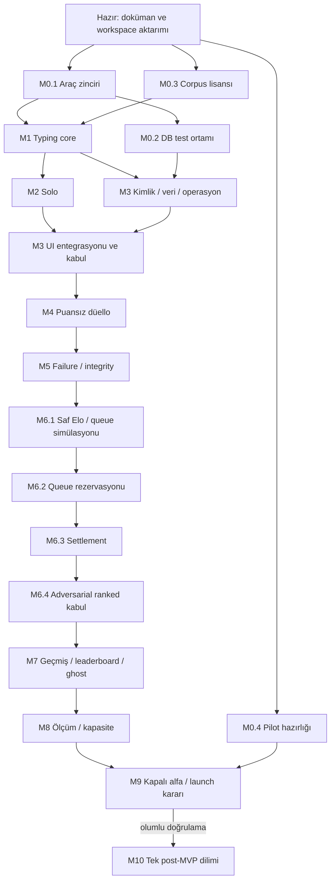

# Sol için uygulama yol haritası

Bu dosya uygulama işlerinin sahibidir. [STATUS](STATUS.md) gerçek ilerlemeyi tutar;
[VALIDATION_ROADMAP](VALIDATION_ROADMAP.md) event/ölçüm ve ürünün devam/düzelt/dur kararının
sahibidir. Oradaki 0–10 sırası burada task'lara açılmıştır; kapsam veya eşikler değiştirilmez.
Her milestone'da AGENTS definition of done ve TESTING tier'ları ayrıca uygulanır.
İş süreleri tahmin edilmemiştir. Dış servis satın alma/yayın bu belgenin tamamlanması değildir.

## Bağımlılık grafiği ve yürütme kuralı

- **Sıralı:** M0.1 → M1 → M2; M3 kabulü → M4 → M5 → M6 → M7 → M8 → M9.
  Her alt task aksi belirtilmedikçe kendi milestone'ında sırayla yürür.
- **Paralellenebilir:** M0.2/0.3/0.4; M1 sonrası M2 ve M3 backend kısmı.
  M3 UI kabulü M2'yi bekler. M7'de read-model/leaderboard ve ghost ayrı sınırlar içinde
  yürüyebilir; ortak settlement/contracts değişikliği önce tek görevde yapılır.
- **Bloker:** gerçek corpus lisansı M1 üretim içerik kabulü/M4 öncesi; kimlik ve yetki
  M4 öncesi; failure semantiği M6 öncesi; ölçüm ve operasyon sorumlusu M9 öncesi.
  M1 reducer deneyi küçük test fixture'ıyla yapılabilir, lisans kapısını geçmiş sayılmaz.
- **Opsiyonel:** önerilen server-observed ısınma M6; ilk 10 koruması için veri yoksa normal
  Elo araması zaten tanımlı. Ghost sistemi M7 MVP işidir; kayıt arzı yokken solo/davet
  sunulur, sahte replay üretilmez. Kapalı alfada izinli örnek toplama ayrıca kaydedilir.
- **Doğrulama sonrası:** M10 ve growth işleri; bunların paket/tabloları şimdi açılmaz.
- Paralel olma olanağı yeni ajan çalıştırma talimatı değildir. Bir ajanla varsayılan yol:
  M0.1, M0.2, M0.3, M0.4 hazırlık kaydı, M1, M2, M3, M4…

Her task başlangıcında STATUS'ta `in_progress`; bitince komut/kanıt ve next task yaz.
Engellenen task için gerekli girdiyi belirt, yalnızca grafikte bağımsız olan işe geç.
Testler ve telemetry ilgili dilimle gelir; bunları M8'e biriktirme.

## M0 — Çalıştırılabilir geliştirme tabanı

**Amaç:** tek install/dev/test yolu; ürün özelliği olmadan çalışır araç zinciri.
**Önkoşul:** mimari aktarımı hazır (bu oturum). Şimdi ilk görev M0.1.

**Görevler:**
- **M0.1:** exact-pinned TypeScript, Vite/React, Fastify, ESLint, Vitest/fast-check ve
  gerekli build araçlarını gerekçeleriyle ekle; lockfile. Ortak strict tsconfig,
  browser/server ayrı target/lib, package export/build sırası, yasak import sınırları.
  Web boş erişilebilir shell ve server app factory/health bootstrap ile yetinsin.
  Root `dev`, `typecheck`, `lint`, `test:unit`, `build` script'lerini ve CI'ı gerçekten
  çalıştır; dotenv yükleyici/feature bazlı env validation kur. Kütüphaneleri sırf
  listede var diye topluca yükleme; kullanılacak dilimde ekle. [Geliştirme](DEVELOPMENT.md).
- **M0.2:** Docker ile disposable Supabase local + gerçek PostgreSQL test yolu, CLI pin,
  migration runner ve ayrı runtime/DDL role kurulumunu belgeli script'lere bağla.
  `db:start`, `db:stop`, `db:migrate`, `db:generate`, `db:seed`, `test:db` komutlarını
  çalıştır. Şimdilik harness/scratch şema; production oyun tabloları M3/M4/M6'da.
- **M0.3:** 1K corpus kaynağını ve dağıtım lisansını doğrula; atıf, kaynak dosya,
  normalized hash, import işlemi ve sürüm kaydı. Unicode/boşluk/duplicate kontrolü;
  generator ve metin tüketim sınırı M1 tasarımına girdi. Uygun lisans bulunmadan indirilmiş
  rastgele kelime listesini production asset yapma.
- **M0.4:** pilot kullanıcı profili, hedef bölge, browser matrisi, incident ve review
  sorumlusu adayları ile ölçüm protokolünü kaydet. Gerçek RTT deneyi M4/M5/M9'da yapılır;
  veri veya insan atanmamışsa açık bloker olarak kalır.

**Kabul:** temiz clone frozen install; web/server derlenir; minimum bootstrap çalışır;
package boundaries doğrulanır; env hatası gizli değer basmadan fail-fast; migration
harness disposable DB'de çalışır. STATUS M0 alt task'larını ayrı raporlar.
**Test:** boş source'u geçen sahte test yerine app factory health/unknown route ve config
redaction smoke; DB bağlantı/role ve migration runner smoke; corpus fixture/hash kontrolü.
**Telemetry:** redacted Pino/correlation/build bağlamı için altyapı; ürün event'i gerekmez.
**UX durumları:** bootstrap loading/failure erişilebilir; özellik/gelecek menüsü yok.
**Risk:** paket uyumsuzluğu, yerel servis/secret engeli, lisans. Bootstrap başarısını ürün
veya Supabase canlı auth doğrulaması sayma.

## M1 — Saf typing ve içerik çekirdeği

**Amaç:** browser ve server aynı akıştan aynı C/A/I ve sonucu üretsin.
**Önkoşul:** M0.1; tam kabul için M0.3. Auth/DB/UI gerektirmez.

**Görevler:**
- **M1.1:** public input/ruleset tipleri; insert/deleteBackward/delete-to-word-boundary
  semantiğini ürün §3 ile örnekle. Saf reducer/replay; hata suffix'i ve buffer sınırları.
- **M1.2:** C/A/I, null accuracy, WPM/raw ve saniyelik özet; deterministik seeded metin
  üretimi, text/hash/version. Skor hesabı süreyi açık argüman alır, saati işletmez.
- **M1.3:** ortak golden fixture ve property testleri; browser adapter input contract'ı
  için composition/paste/selection davranışını tanımla (adapter M2).

**Kabul:** 300 C/30s=120 WPM; hatayı silmek önceki I/A tarihini silmez; C gerileyebilir;
aynı seed/stream aynı sonuç; boş test accuracy göstermez; gizli tiebreak yok.
**Test:** bounded random stream replay, error→correct→delete, word boundary, boş silme,
I=0, limit ve invalid normalization; core Node'da DOM/DB açmadan test edilir.
**Telemetry:** core saf kalır; duration/count/reason çıktıları adapter ölçümüne yeterli.
**UX durumları:** hata/boş metrik açıklaması sözleşmesi; ekran geliştirilmez.
**Risk:** yanlış suffix/sayaç tanımı ve client/server ayrışması; golden örnekleri ortak tut.

## M2 — Solo dikey dilim

**Amaç:** hesapsız hızlı ve klavyeyle kullanılabilir solo.
**Önkoşul:** M1; M3 backend bağımsız ilerleyebilir.

**Görevler:**
- **M2.1:** web input/composition adapter, external store, frame render ve timer; 15/30/60
  solo, ilk input başlangıcı, keyboard restart, süre değişiminin sonraki teste uygulanması.
- **M2.2:** `/` ve `/practice` aynı ekran; kullanılan token/UI bileşenleri, English
  localization keys, dört bölümün ilgili guest tercihleri, küçük local history ve summary.
  Kalıcı storage kapalı/dolu/bozuk ise in-memory fallback ve açık kayıt durumu.
- **M2.3:** responsive/a11y ve input-to-paint ölçümü; browser/keyboard gerçek yolculukları.

**Kabul:** kayıt/login zorunluluğu yok; C/WPM/accuracy ve grafik doğru; local sonuç trust
etiketli; font swap/layout shift aktif testi bozmaz; typing dışı alanda tuş yakalanmaz.
**Test:** Vitest adapter/elapsed sınırları, Playwright Chromium/Firefox/WebKit, composition,
paste/drop, focus/Tab/Escape, 320/390px ve desktop, zoom/reflow, storage failure.
**Telemetry:** izinli `typing_started/completed/abandoned`, first-input/input-to-paint ölçümü;
raw text yok. Endpoint M3'te gelene kadar typed adapter/test sink; sonsuz offline kuyruk yok.
**UX durumları:** kaynak loading/error, boş geçmiş, local save failure, supported input açıklaması.
**Risk:** virtual keyboard/IME, render gecikmesi, browser background throttling.

## M3 — Kimlik, veri ve operasyon tabanı

**Amaç:** güvenli hesap ve kalıcı veri sınırı; rollout için temel işletim yolu.
**Önkoşul:** M1 + M0.2; M3 UI kabulü M2'yi bekler.

**Görevler:**
- **M3.1:** private schema, least-privilege roles; user/profile/session/settings/consent,
  solo summary ve privacy request migrations; runtime env ve outbox/job tabanı.
- **M3.2:** Supabase Google OAuth/OTP server BFF; state/PKCE/redirect allowlist, opaque
  hashed sessions, encrypted refresh/single-flight, CSRF/Origin, logout/revocation,
  guest session. Profile/privacy ve kaydedilen solo `client_reported` güven seviyesi.
- **M3.3:** export/deletion jobs, private storage, retention ve restore/tombstone süreci;
  küçük admin role/MFA sınırı, rate limits, readiness/health ve scrubbed monitoring.
- **M3.4:** auth/settings/profile/history UI bağlantısı; local solo kayıtları sessizce
  verified yapma. İlk migration deploy/restore ve gerçek staging SMTP/OAuth kanıtı.

**Kabul:** başka kullanıcının private verisi alınamaz; hiçbir provider tokenı browser'a
sızmaz; refresh race güvenli; restore sonrası silinen kimlik geri açılmaz; solo auth
outage'da çalışır. Local build, staging sağlayıcı doğrulaması ve restore ayrı kanıtlardır.
**Test:** PostgreSQL grants/constraints/upgrade, cookie/CSRF/redirect/refresh/session tests,
export/deletion retry/TTL, secrets redaction; gerçek login smoke ve keyboard E2E.
**Telemetry:** auth completion server-owned; consent-aware endpoint dedupe, job/outbox lag,
DB/SMTP failure, retention failure alert. Email/OTP event alanı değil.
**UX durumları:** OTP waiting/expired/rate-limited, OAuth canceled/provider down, private
profile denied, history empty, settings saving/failed, export/deletion pending/failed.
**Risk:** cookie dev/prod farkı, SMTP/Google kurulumu, identity link hatası, destructive seed.

## M4 — Puansız iki oyunculu düello

**Amaç:** gerçek iki browser'da aynı text/time ve server skoru; rating henüz yok.
**Önkoşul:** M1–M3 tamam, lisanslı corpus. Gerçek süreç ve DB kullanılır.

**Görevler:**
- **M4.1:** invite/Match/Participant/TextArtifact/ActiveParticipation/Result migrations,
  sözleşmeler ve iki kişilik atomik invite kabulü; guest + hesap yetkisi.
- **M4.2:** WebSocket-only authenticated Socket.IO adapters, explicit state machine,
  ready/content ack, ortak countdown, monotonic receive window, bounded input replay.
- **M4.3:** progress/snapshot/result; transaction sonrası emit ve sonuç okuma endpoint'i;
  minimum invite/lobby/live/result UI. Production queue kapalı kalır.

**Kabul:** 30 saniye, aynı text/hash; client winner/WPM/time gönderse bile sonuç değişmez;
start öncesi cancel puansız; guest rating/profile edinmez; third participant reddedilir.
**Test:** socket.io-client integration + iki gerçek browser context; ready timeout,
start/son event sınırı, duplicate komut, invite GET/expired/full ve permission bypass.
**Telemetry:** challenge create/join/expire, ready/start/finalized outbox, ACK lag, seq gap,
progress age, receive deadline drops. Davet sırrı URL/loglarda görünmez.
**UX durumları:** host yok, oda dolu, link expired, text hazırlanamıyor, ready bekliyor,
doğrulanıyor/sonuç hatası; WSS engelinde solo alternatifi.
**Risk:** transport'u delivery guarantee sanmak, client time'a güvenmek, auth üyeliği sızıntısı.

## M5 — Failure ve integrity sertleştirme

**Amaç:** hatalı sonuç ve haksız forfeit yollarını rated açılmadan kapatmak.
**Önkoşul:** M4; bu milestone atlanarak Elo/queue yayına alınmaz.

**Görevler:**
- **M5.1:** 5s resume/liveness, generation fencing, snapshot reconcile, explicit second-tab
  takeover; seq duplicate/conflict/gap, 500ms backlog, paket/olay/kaynak limitleri.
- **M5.2:** owner lease/epoch, overlap fencing, 60s deploy drain, DB down/retry ve crash
  recovery; commit sonrası emit crash'inde GET aynı sonucu getirir.
- **M5.3:** bounded evidence, report/review/appeal/audit, admin MFA, TTL, review timeout
  ve no-contest. Düşük güven sinyalleri tek başına sonucu/hesabı kalıcı cezalandırmaz.
- **M5.4:** fault/RTT harness ile [TESTING](TESTING.md) matrisini çalıştır; kayıp karakter ve
  gerçek browser hissini raporla. Haksızlık çözülemiyorsa ranked blokerini yaz.

**Kabul:** eski owner/socket puan etkileyemez; offline backfill yok; server loss oyuncuya
loss değil; durable review deploy ile kaybolmaz; 24h timeout lock release güvenli.
**Test:** 1/4/6s kopma, double-abandon, final nonce/deadline, wall-clock jump, DB kesintisi,
kill-before/after-commit, overlap, malformed/oversized/flood input; 20/100/200ms RTT+jitter.
**Telemetry:** connection transitions/no-contest reasons, owner loss, event-loop, review
age, rate-limit ve retention failures; anomaly sinyallerinin düşük güven sınıfı korunur.
**UX durumları:** reconnect/time continues, resuming/lost input, forfeit/no-contest,
pending review/timeout, report received; kesin kanıt olmadan hileci etiketi yok.
**Risk:** yanlış pozitif, indefinite review, koşullu lease/finalization yarışları.

## M6 — Elo, matchmaking ve atomik settlement

**Amaç:** tek rated kuyruk ve açıklanabilir, bir kez etkili puan değişimi.
**Önkoşul:** M5 kabulü; canonical [ranking](RANKING_MATCHMAKING.md) yeniden okunur.

**Görevler:**
- **M6.1:** saf Elo/provisional/eligibility fonksiyonları; clock/RNG enjekte edilmiş queue
  policy; golden örnekler ve 2/10/50 oyunculu newcomer/sandbag/inactivity simülasyonu.
- **M6.2:** RatingCurrent/Ledger/pair-start migrations; DB atomic ticket reservation,
  live participation ve unresolved rating kilitleri; karşılıklı widening/pair cap/RTT,
  ready no-show geri alma, versioned cooldown. Optional warmup sonuçları ayrı trust sınıfı.
- **M6.3:** stable-order locking, immutable results, iki rating delta, outbox, pending
  review ve compensation transaction'ları; null uniqueness ve idempotent retry.
- **M6.4:** ranked UI'yı sözleşmelere bağla ve adversarial DB/socket yarış testlerini geçir;
  sonuç commit olmadan rating veya galibiyet sunma. Leaderboard görünümü M7.

**Kabul:** ilk 10 K=64 sonra 32; kesirli rating korunur; iki oyuncu aynı snapshot'tan
hesaplanır; no-contest/private/ghost puansız; 100 finalize retry tek etki; pending review
rated'i kapatır, başka puansız maç rezervasyonunu temizlemez; compensation aktif snapshot'ı bozmaz.
**Test:** Elo sayısal fixtures; eşit/farklı rating draw ve farklı K, provisional boundary;
15/30/60s queue boundary, mutual window, 24h pair cap/start race, 120s bekleme,
concurrent finalization/rollback/compensation, review timeout vs finalize, same-user tabs.
**Telemetry:** queue join/end tüm terminal nedenleriyle, wait/RTT/rating buckets; settlement
latency/retry, duplicate invariant alarmı, weekly newcomer rating drift; outbox dedupe.
**UX durumları:** provisional, connection ineligible, empty queue/30s/60s, canceled,
ready/no-show, result validating/review/no-contest, puan değişimi nedeni.
**Risk:** yanlış rounding/K boundary, half-settlement, düşük nüfusta caps, hidden rating policy.

## M7 — Geçmiş, leaderboard ve dürüst fallback

**Amaç:** ana ranked döngüsünü ve MVP'nin sonuç/low-population yüzlerini tamamlamak.
**Önkoşul:** M6; M7.2 ve M7.3 M7.1 sözleşmesinden sonra paralellenebilir.

**Görevler:**
- **M7.1:** owner-only history/public rank response allowlist, keyset queries/cache,
  leaderboard eligibility/projection; migration gerekirse sorguyla birlikte.
- **M7.2:** history/profile/tek leaderboard, shared rank ve provisional sunumu; yeni rakip,
  puansız rövanş, invite block/rapor/appeal ve correction history kullanıcı yolu.
- **M7.3:** izinli server-observed ghost projection/revoke; aynı orijinal metin/ruleset,
  coarse curve; queue ticket atomik iptal sonrası açık kullanıcı seçimiyle geçiş.
  Replay yoksa solo/davet fallback; onboarding için sahte canlı kayıt yok.

**Kabul:** 20 maç/5 rakip/14 gün ve review kuralları; eşit rating ortak sıra; Top 10 review;
private history sızmaz; source erasure/withdrawal ghost'u kaldırır; normal evidence TTL
bağımsız izinli ghost'u yanlışlıkla silmez; ghost hiçbir rated sonuç üretmez.
**Test:** eligibility tarih sınırları/ties/keyset, API privacy, ghost consent/deletion,
queue→ghost race, unrated rematch ve responsive/keyboard E2E; revocation retry.
**Telemetry:** result viewed vs finalized ayrımı, new opponent/rematch request/accept,
ghost start/complete ve consent kapsamı; local replay client-report etiketi.
**UX durumları:** boş/eligible olmayan leaderboard nedeni, private profile, withdrawn ghost,
incelemede/düzeltilmiş sonuç, veri yok, API loading/error; ghost/live ayrımı sürekli görünür.
**Risk:** rate/projection tutarsızlığı, yanlış analytics completion, aynı metinde tekrar avantajı.

## M8 — Ölçüm, yük ve işletim kapısı

**Amaç:** ölçülebilir kalite, gerçek admission cap ve güvenilir raporlar.
**Önkoşul:** M3–M7 emit/testleri mevcut; eksik telemetry bu aşamaya ertelenmiş sayılmaz.

**Görevler:**
- **M8.1:** event/outbox consumer tekrarları, consent/retention, versioned SQL funnel/cohort
  raporları; synthetic/test kullanıcı filtreleri ve received-time güven sınırı.
- **M8.2:** load/fault ramp, 100 bağlantı/50 running match başlangıç senaryosu, node sınırına
  kontrollü artış ve 60 dakika soak; CPU/RAM/event-loop/DB/ACK/progress/score drift kaydı.
- **M8.3:** sürdürülebilir kapasitenin en fazla %50'si admission cap; alert teslim/alıcı,
  deploy drain/rollback, backup restore ve privacy cleanup tatbikatı.

**Kabul:** duplicate event sayımı yok; canceled/timeout beklemeleri saklanmıyor; olgunlaşmamış
D7/D30 cohort denominator dışında; SLO değerleri cihaz/node/RTT/metot ile raporlu.
Kapasite aşımında yeni ranked admission kapanır, mevcut sonuç bütünlüğü korunur.
**Test:** replay event idempotency, timestamp/time-window fixtures, consent-redaction;
Socket.IO load/fault harness, soak memory, outage/deploy/restore, alert smoke.
**Telemetry:** mevcut katalog bütünlüğü, drop/lag ve consent kapsam oranı; hiçbir input raw
stream analytics sağlayıcısına gitmez. KPI raporunda pay/payda/n ve sınırlamalar.
**UX durumları:** maintenance/admission full, analytics yokken oyun, geciken sonuç ve açık retry.
**Risk:** localhost benchmark'ını prod saymak, matched-only bias, test trafik kirliliği.

## M9 — Kapalı alfa ve public launch kararı

**Amaç:** güvenilirlik, rakip arzı ve farklı gün geri dönüşünü birlikte doğrulamak.
**Önkoşul:** M8; M0.4 gerçek sorumlular ve pilot ölçümleri tamam; hizmet/SMTP/domain,
corpus, hedef pazar/yaş/consent ve restore koşulları doğrulanmış.

**Görevler:**
- **M9.1:** farklı hız/ping grupları, 5–8 kullanıcı UX görev testi; izinli ghost kayıtları;
  iki haftalık olgunlaşan cohort ve en az 100 first-ranked hedefi için kontrollü pilot.
- **M9.2:** VALIDATION_ROADMAP §4 eşikleriyle devam/düzelt/dur raporu; örneklem/CI/pay-payda,
  peak/off-peak ve excluded RTT görünür. Gerekirse pilotu uzat, başarı uydurma.
- **M9.3:** public launch'tan önce ruleset/rozet sınırlarını dondur; inceleme/incident
  sorumlusu, özel güvenlik bildirim kanalı, privacy, restore, build/migration/live E2E
  kanıtları ve release notu.

**Kabul:** §4 kararı yazılı ve kanıtlı; çift rating sıfır; kritik exploit açık değil;
review operasyonu 24h hedefini sürdürebiliyor. Public açılış ayrı, bilinçli release kararı.
**Test:** staging/release smoke, gerçek iki kullanıcı, keyboard/a11y/IME ve yüksek RTT,
incident/review/restore tatbikatları; synthetic test tek başına yeterli değil.
**Telemetry:** D1/D7/weekly two-day, yield/completion/no-contest ve newcomer mismatch;
normal forfeit completion başarı metriğine katılmaz.
**UX durumları:** açıklamasız ilk solo/ranked, puan açıklaması, iptal, davet, ghost,
reconnect, ayar ve rapor görevleri; gerçek takılmalar kaydedilir.
**Risk:** küçük cohort/etkinlik yanlılığı, oyuncu yoğunluğu, moderation kapasitesi.

## M10 — Yalnızca doğrulama sonrası bir genişleme

**Amaç:** doğrulanmış talebe göre tek bir yeni dilim; MVP için bloker değildir.
**Önkoşul:** M9 olumlu karar ve seçilen ihtiyacın kanıtı; hepsi birlikte uygulanmaz.

**Görevler:**
- **M10.1:** seçim kaydı: adaptif pratik **veya** arkadaş/davet yönetimi **veya** reset
  içermeyen sezon görünümü. Küçük puansız race ancak ayrıca talep/yük kanıtıyla aday olur.
- **M10.2:** yalnızca seçilen dilimin schema/protokol/UX ADR güncellemesi ve task listesi;
  seçilmeyen sistemlerin boş modüllerini ekleme.
- **M10.3:** sınırlı rollout ve devam/geri çekme değerlendirmesi.

**Kabul:** ücretsiz gelişim ve accessibility korunur; season rating resetlemez; friends
ranked opponent kaçırma yolu olmaz; race 1v1 Elo'yu parçalayıp kullanmaz.
**Test:** adaptifte deterministic generator/data sufficiency/control probe; friends'te
consent/block/privacy; season'da snapshot/eligibility; race'de fanout/yük. Yalnızca seçileni uygula.
**Telemetry:** seçilen feature'ın voluntary repeat/retention ve ilgili mevcut post-MVP
kataloğu; nedensel gelişim veya para vaadi yok.
**UX durumları:** veri yetersiz/ilk kullanım/loading/empty/error ve geri dönüş yolu.
**Risk:** scope genişlemesi; MVP retention sorununu yeni özellik ile gizlemek.
